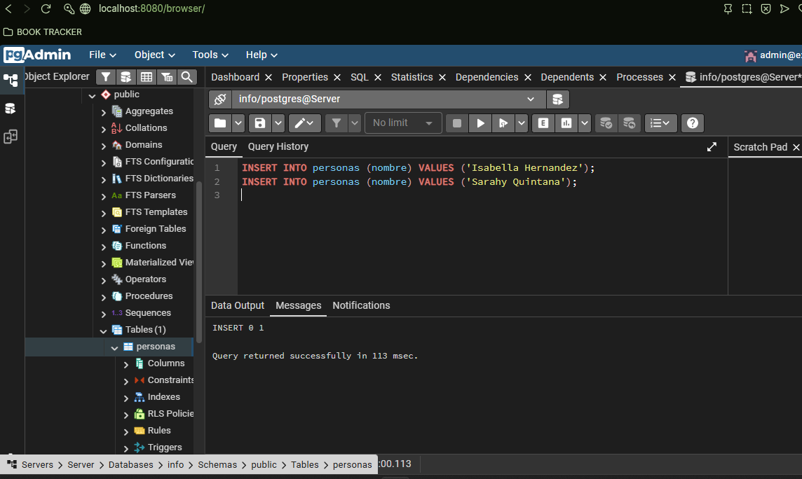
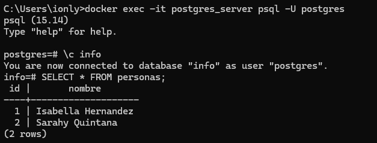

### Crear contenedor de Postgres sin que exponga los puertos. Usar la imagen: postgres:15-alpine3.21

```
docker run -d --name postgres_server -e POSTGRES_PASSWORD=secret postgres:15-alpine3.21
```

### Crear un cliente de postgres. Usar la imagen: dpage/pgadmin4

```
docker run -d --name pgadmin_client -e PGADMIN_DEFAULT_EMAIL=isabellahq29@gmail.com -e PGADMIN_DEFAULT_PASSWORD=admin -p 8080:80 dpage/pgadmin4
```

La figura presenta el esquema creado en donde los puertos son:
- a: 5432
- b: pgAdmin
- c: 8080


## Desde el cliente
### Acceder desde el cliente al servidor postgres creado.
http://localhost:8080/login?next=/

# COMPLETAR CON UNA CAPTURA DEL LOGIN


### Crear la base de datos info, y dentro de esa base la tabla personas, con id (serial) y nombre (varchar), agregar un par de registros en la tabla, obligatorio incluir su nombre.

```
CREATE DATABASE info;

--conexion
\c info

-- tabla
CREATE TABLE personas (
    id SERIAL PRIMARY KEY,
    nombre VARCHAR(50)
);

-- Insertar registros
INSERT INTO personas (nombre) VALUES ('Isabella Hernandez');
INSERT INTO personas (nombre) VALUES ('Sarahy Quintana');
```



## Desde el servidor postgresl
### Acceder al servidor
### Conectarse a la base de datos info

```
docker exec -it postgres_server psql -U postgres

\c info
```

### Realizar un select *from personas


