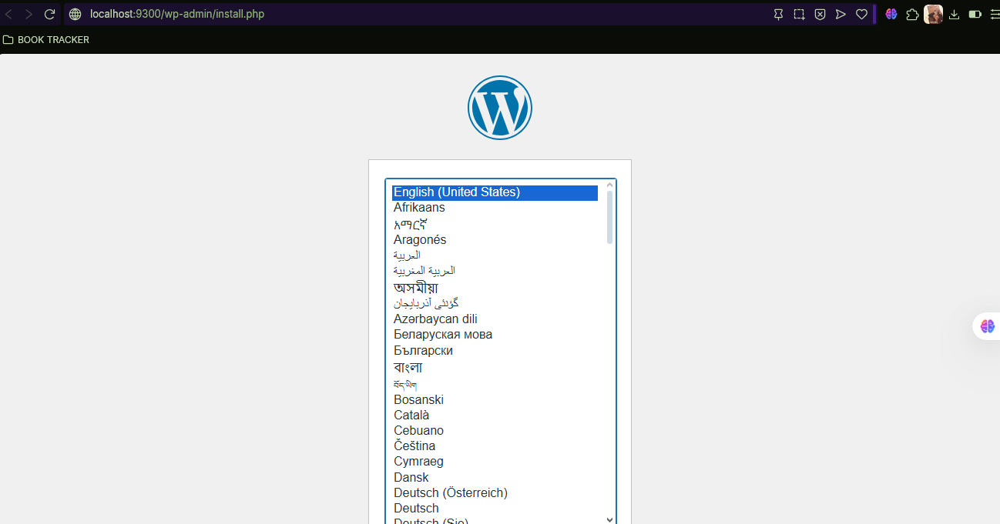
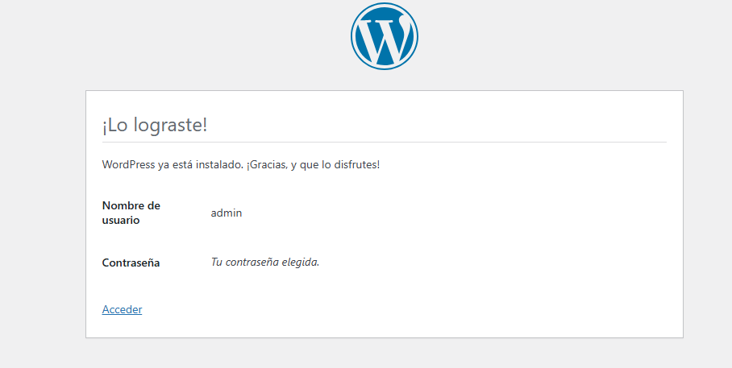
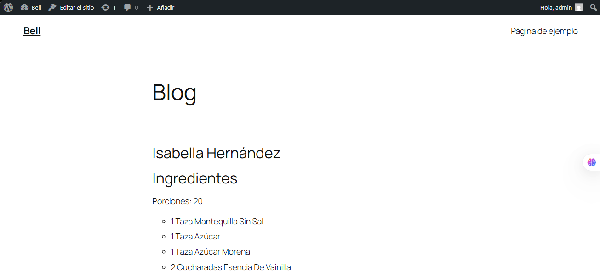
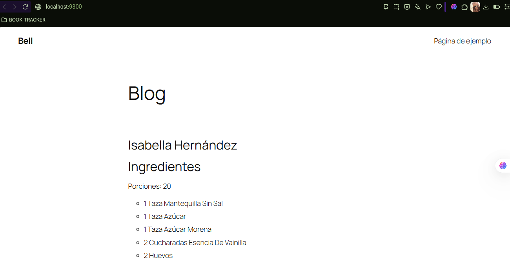

## Esquema para el ejercicio


### Crear la red
```
docker network create net-wp -d bridge
```

### Crear el contenedor mysql a partir de la imagen mysql:8, configurar las variables de entorno necesarias

```
docker run -d --name mysql --network net-wp -e MYSQL_ROOT_PASSWORD=rootpassword -e MYSQL_DATABASE=wordpress -e MYSQL_USER=wordpress -e MYSQL_PASSWORD=wordpresspassword mysql:8
```

### Crear el contenedor wordpress a partir de la imagen: wordpress, configurar las variables de entorno necesarias

```
docker run -d --name wordpress --network net-wp -p 9300:80 -e WORDPRESS_DB_HOST=mysql -e WORDPRESS_DB_USER=wordpress -e WORDPRESS_DB_PASSWORD=wordpresspassword -e WORDPRESS_DB_NAME=wordpress wordpress
  ```

De acuerdo con el trabajo realizado, en el esquema del ejercicio el puerto a es **9300**

Ingresar desde el navegador al wordpress y finalizar la configuración de instalación.





Desde el panel de admin: cambiar el tema y crear una nueva publicación.
Ingresar a: http://localhost:9300/ 
recordar que a es el puerto que usó para el mapeo con wordpress


### Eliminar el contenedor wordpress

  ```
docker rm wordpress
  ```

### Crear nuevamente el contenedor wordpress
Ingresar a: http://localhost:9300/ 
recordar que a es el puerto que usó para el mapeo con wordpress



### ¿Qué ha sucedido, qué puede observar?
El sitio mantiene toda la configuración y contenido previo, tanto la publicación creada como el tema y los datos, esto debido a que MySQL es el que mantiene dicha información


